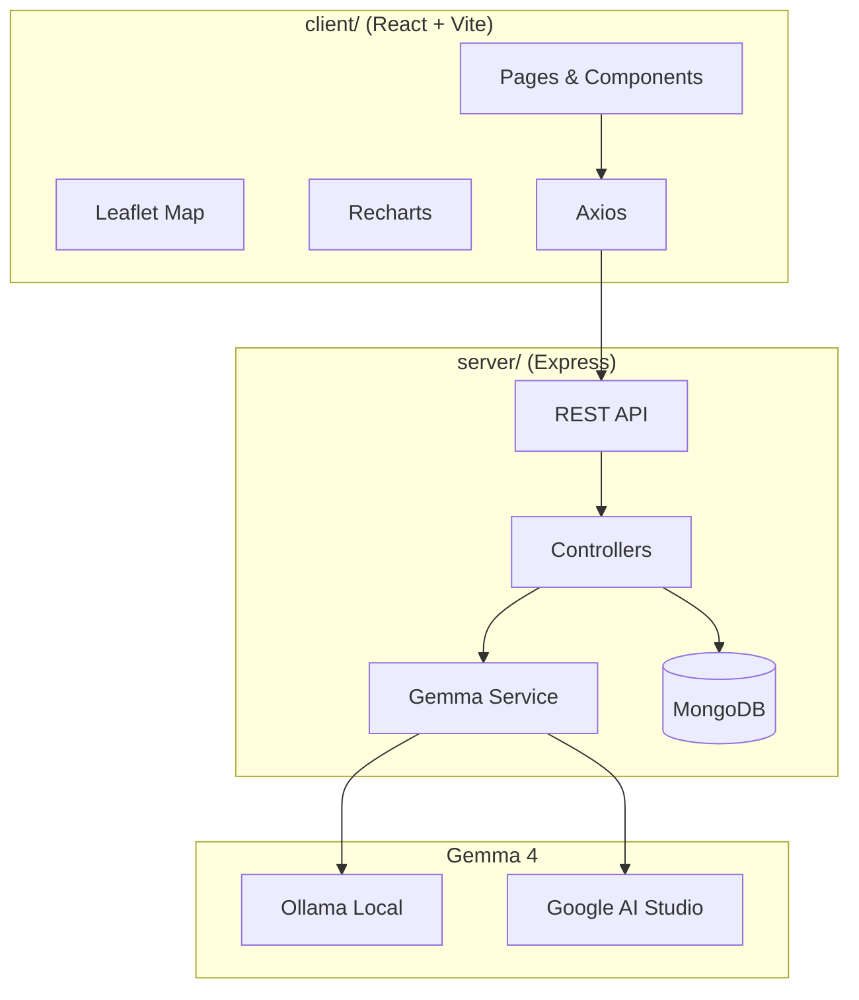

# OutbreakIQ

**AI-powered GIS Disease Outbreak Assistant** — built for the **Gemma 4 Good Hackathon**.

OutbreakIQ helps users visualize disease hotspots on an interactive map, explore dashboard analytics, chat with a Gemma-powered assistant grounded in outbreak data, and generate prevention recommendations for each record.


## Features

| Feature | Description |
|---------|-------------|
| **Interactive Map** | Leaflet map with severity color-coded markers (green / yellow / red) |
| **Dashboard** | Summary cards + bar, line, and pie charts (Recharts) |
| **AI Chat** | Natural-language Q&A with outbreak context via Gemma 4 |
| **Prevention** | Per-outbreak AI recommendations (symptoms, actions, risk) |
| **Filters** | Disease, severity, date range, region, and search |
| **Admin CRUD** | Add, edit, delete outbreak records |
| **PDF Export** | Download filtered outbreak reports |
| **Dark Mode** | Theme toggle with persistence |
| **Voice Input** | Speech-to-text for AI chat (supported browsers) |

## Architecture



## Project Structure

```
OutbreakIQ/
├── client/          # React frontend (Vercel)
├── server/          # Express API (Render)
├── package.json     # Root scripts (npm run dev)
└── README.md
```

## Quick Start

### Prerequisites

- Node.js 18+
- MongoDB (local or Atlas)
- Optional: [Ollama](https://ollama.com) with a Gemma model for full AI responses

### Installation

```bash
git clone <your-repo-url>
cd OutbreakIQ
npm install
npm install --prefix server
npm install --prefix client
```

### Environment

**server/.env** (copy from `server/.env.example`):

```env
PORT=5000
MONGODB_URI=mongodb://127.0.0.1:27017/outbreakiq
GEMMA_PROVIDER=ollama
GEMMA_API_URL=http://127.0.0.1:11434
GEMMA_MODEL=gemma2:2b
# For Google AI Studio:
# GEMMA_PROVIDER=google
# GEMMA_API_KEY=your_key
# GEMMA_MODEL=gemma-2-9b-it
```

**client/.env** (optional):

```env
VITE_API_URL=http://localhost:5000/api
```

### Seed sample data

```bash
# Start MongoDB, then:
npm run seed
```

Sample outbreaks include **Dengue (Delhi)**, **Malaria (Kolkata)**, **COVID-19 (Mumbai)**, **Cholera (Chennai)**, and **Nipah (Kerala)**.

### Run development

```bash
npm run dev
```

- Frontend: http://localhost:5173  
- API: http://localhost:5000/api/health  

The server auto-seeds from `server/data/sample-outbreaks.json` when the database is empty.

**No MongoDB?** The API falls back to an in-memory store loaded with the same sample data so you can demo immediately. For production, use MongoDB Atlas.

## API Routes

| Method | Route | Description |
|--------|-------|-------------|
| GET | `/api/outbreaks` | List outbreaks (query filters supported) |
| GET | `/api/outbreaks/stats` | Dashboard analytics |
| GET | `/api/outbreaks/report/pdf` | PDF export |
| GET | `/api/outbreaks/:id` | Single outbreak |
| POST | `/api/outbreaks` | Create outbreak |
| PUT | `/api/outbreaks/:id` | Update outbreak |
| DELETE | `/api/outbreaks/:id` | Delete outbreak |
| POST | `/api/ai/chat` | AI chat `{ message, outbreakId? }` |
| POST | `/api/ai/recommendations` | AI prevention `{ outbreakId?, disease? }` |

## Deployment

### Frontend (Vercel)

1. Import `client/` as the project root (or set Root Directory to `client`).
2. Build command: `npm run build`
3. Set `VITE_API_URL` to your Render API URL (e.g. `https://your-api.onrender.com/api`).

### Backend (Render)

1. Create a Web Service from `server/`.
2. Build: `npm install` · Start: `npm start`
3. Add env vars: `MONGODB_URI`, `GEMMA_*`, `CLIENT_URL` (Vercel URL).
4. Use `server/render.yaml` as a blueprint if desired.

### MongoDB

Use [MongoDB Atlas](https://www.mongodb.com/atlas) free tier and set `MONGODB_URI` on Render.

## Hackathon Justification

- **Social impact:** Surfaces outbreak patterns and prevention guidance for communities and health workers.
- **Gemma 4 core:** Chat and recommendations use Gemma via Ollama or Google AI Studio with structured outbreak context.
- **Responsible AI:** Prompts require grounding in provided data and explicit uncertainty when information is missing.
- **Production-ready:** Modular backend, validated CRUD, error handling, responsive UI, and deploy configs.

## Demo Screenshots

Place screenshots in `docs/screenshots/` after running locally:

1. Home + map preview  
2. Dashboard charts  
3. AI assistant chat  
4. Prevention recommendations  

## License

MIT — for hackathon and educational use. Verify health data with official sources before operational use.
